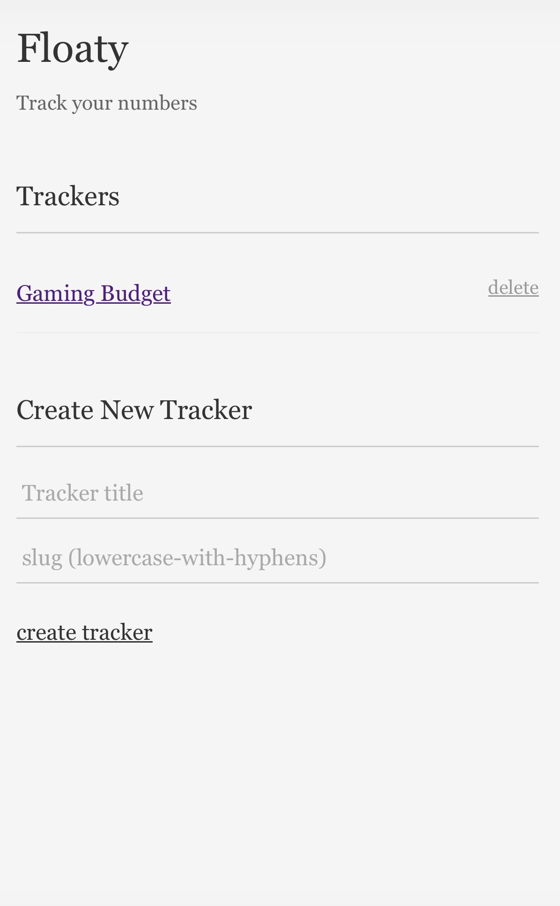
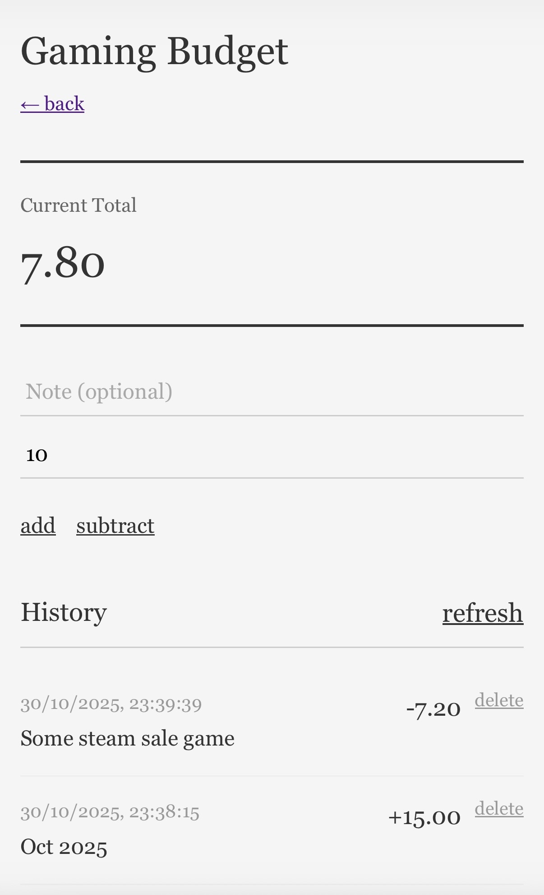

# Floaty

## Multiple Numbers Rolling Totals

_THIS IS NOT A PRODUCTION GRADE APP, ONLY MEANT FOR (my own) PERSONAL USAGE_

_Almost entirely written with Claude Sonnet 4.5 (including this README)._

A simple web application that tracks multiple rolling totals with manual additions/subtractions.

This is entirely a personal tool I made to keep track of my things.
I have zero plans to improve this as of now.
_Neither do I endorse the style of code that is in `main.go`_.
That being said, if you do want to use it, feel free. It's decent looking, it's tiny and it works!

## Screenshots




## Features

- **Multiple trackers** - Configure multiple independent number trackers
- **Add/Subtract values** with optional notes
- **Delete transactions** - Remove manual transactions with soft deletes
- **Event-sourced storage** - All changes logged to append-only files
- **Mobile-friendly** - Rresponsive design that works on all devices
- **Dockerized** - Fully self-contained deployment

## Quick Start

### Inner Workings

Each tracker gets:

- Its own URL: `/{slug}`
- Its own log file: `data/{slug}.log`
- Its own API endpoints: `/api/{slug}/*`

### Run Locally (Development)

```bash
# Run the server
go run main.go
```

Access the app at http://localhost:8080

### Build and Run with Docker

```bash
# Build the image
docker build -t floaty .

# Run with config and data mounted
docker run -d -p 8080:8080 \
  -v $(pwd)/data:/data \
  --name floaty \
  floaty
```

**Important mounts:**

- `data/` - Directory where event logs are stored

## Configuration

### Environment Variables

- `PORT` - HTTP port (default: `8080`)

## How It Works

### Event Sourcing

All changes are stored as events in `data/{slug}.log` as JSON lines.

### Soft Deletes

Deleting a transaction appends a deletion marker to the log. The event remains in the file but is filtered out when reading.

## API Endpoints

### Homepage

- `GET /` - List of all trackers

### Per-Tracker Endpoints

- `GET /{slug}` - Tracker UI
- `GET /api/{slug}/total` - Get current total
- `GET /api/{slug}/events` - Get all events
- `POST /api/{slug}/add` - Add value `{"value": 50.0, "note": "optional"}`
- `POST /api/{slug}/subtract` - Subtract value `{"value": 25.0, "note": "optional"}`
- `POST /api/{slug}/delete` - Delete transaction `{"id": "event-id"}`

## Data Persistence

Event logs are stored in the `data/` directory:

- `data/personal.log`
- `data/business.log`
- etc.

**Always mount the data directory** to persist data across container restarts.

## Forking

If you choose to fork this repository, ensure you set the secrets for the Github actions to work.
